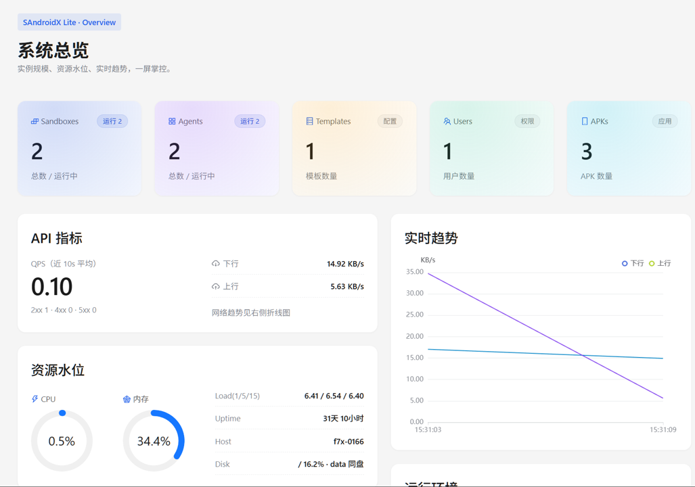
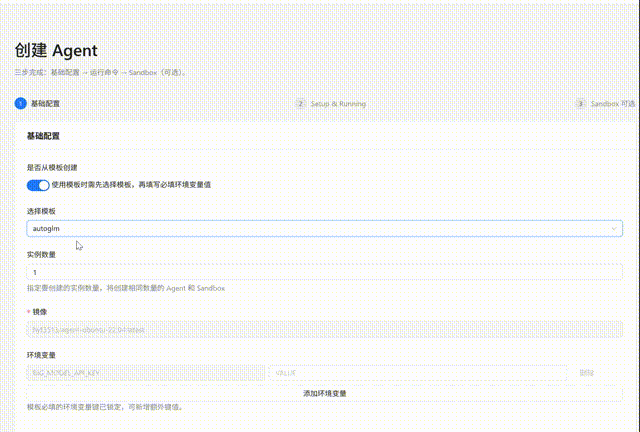
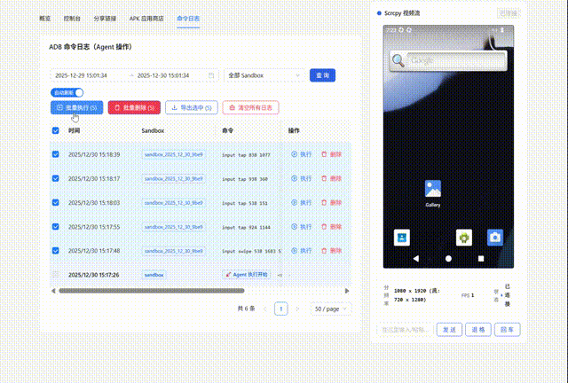
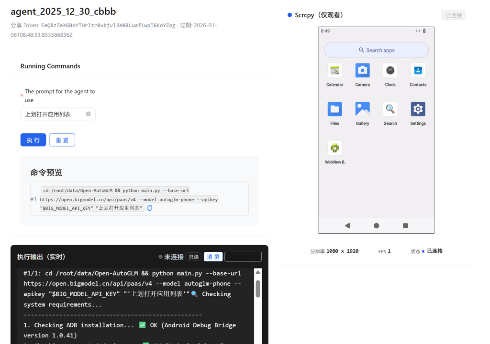
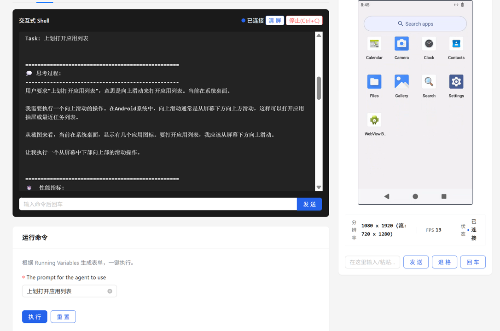
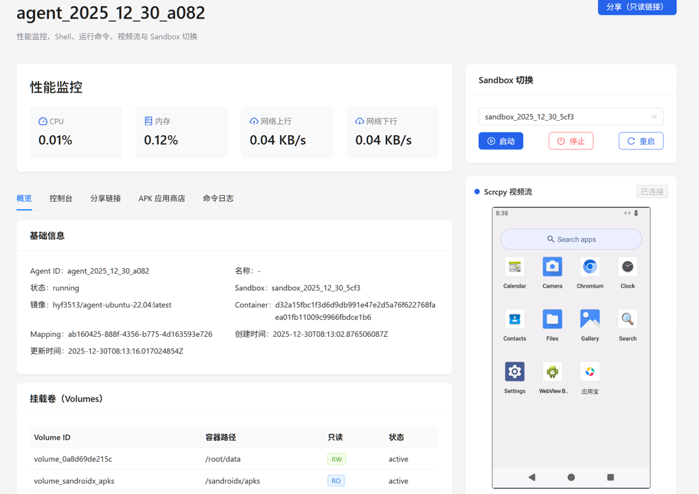
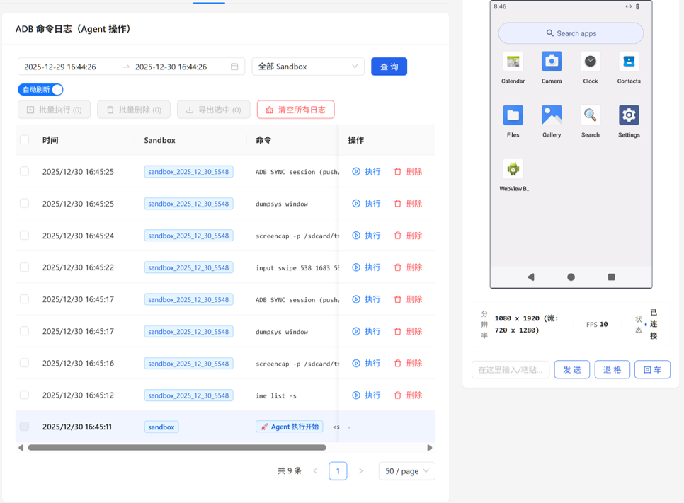
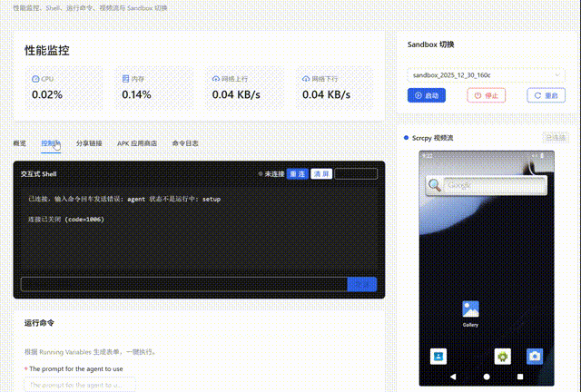
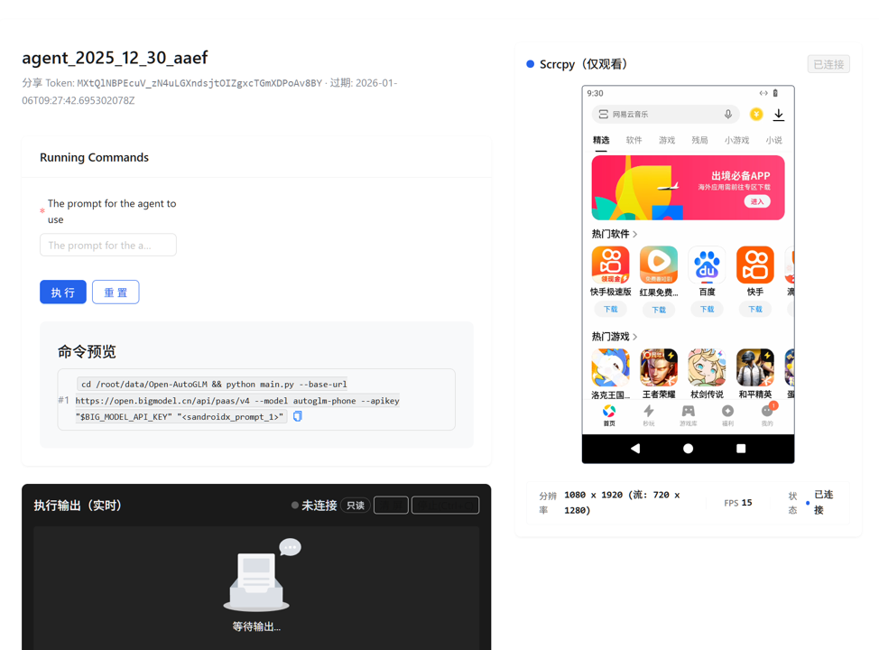

# SandroidX Lite: Agent-Centric Sandbox for Android

一个专为 Android Agent 设计的沙盒环境，提供一键启动、可观测、可复现的 Agent 操作体验。



## ✨ 核心特性

### 🚀 Agent 沙盒一键启动
快速创建和启动 Android Agent 沙盒环境，无需复杂配置即可开始使用。



### 📋 可观测、可复现 Agent 操作
实时监控 Agent 的操作过程，支持操作回放，确保每次执行都可追溯、可复现。



### 📤 轻松分享 Agent Demo
一键生成并分享 Agent 演示，让团队成员快速了解 Agent 的能力和效果。



### 📱 应用一键推送
快速将应用推送到 Android 设备，简化应用部署流程。



## 🎯 功能展示

### Agent 详情页面
查看 Agent 的详细信息和执行状态。



### Agent 执行记录
追踪和查看 Agent 的历史执行记录。



### Agent 演示
观看完整的 Agent 演示流程。


## 🎨 Agent范例

### AutoGLM Demo
这个范例是一个基于 [AutoGLM](https://github.com/zai-org/Open-AutoGLM) 构建的 Agent 示例，展示了如何利用SandroidX沙盒环境进行 Agent 开发和测试。


你可以通过以下在线 Demo 体验 **AutoGLM on Sandroidx**：

[Demo](https://demo.sandroidx.com/share/agents/S97bhag-RdWzJgLLaoyLa7OI4rFMqQDjE-AMpS4tJBo)
## 🛠️ 技术栈

- **后端**: Go (Gin Framework)
- **前端**: Vue.js
- **数据库**: SQLite / MySQL
- **容器化**: Docker
- **Android 连接**: ADB Gateway + Scrcpy

## 📋 快速开始

1. **克隆仓库**
   ```bash
   git clone https://github.com/hyf3513OneGO/sandroidx_lite
   cd sandroidx_lite
   ```

2. **配置环境**
   - 编辑 `configs/config.json` 配置文件
   - 建议重点修改以下敏感配置项，提升安全性
     - `"gateway_token"`: 用于 ADB Gateway 鉴权
     - `"upload_token"`: 用于 ADB Gateway 上传鉴权
     - `"jwt_secret"`: 用户登录态的 JWT 密钥


3. **启动服务**
   ```bash
   go run main.go
   ```

4. **访问界面**
   - 打开浏览器访问 `http://localhost:6080`

## 📖 API 文档

启动服务后，访问 Swagger API 文档：
```
http://localhost:6080/swagger/index.html
```

## 🙏 致谢

本项目基于以下优秀的开源项目构建：

- **[Open-AutoGLM](https://github.com/zai-org/Open-AutoGLM)** - 一个开放的手机 Agent 模型和框架，为 AI 手机应用提供了强大的基础能力
- **[remote-android](https://github.com/remote-android)** - 远程 Android 设备管理解决方案
- **[redroid](https://github.com/ERSTT/redroid)** - 基于容器的 Android 运行时环境

感谢这些项目为 SandroidX Lite 提供的技术支持和灵感！

## 📝 许可证

[添加许可证信息]

## 🤝 贡献

欢迎提交 Issue 和 Pull Request！
